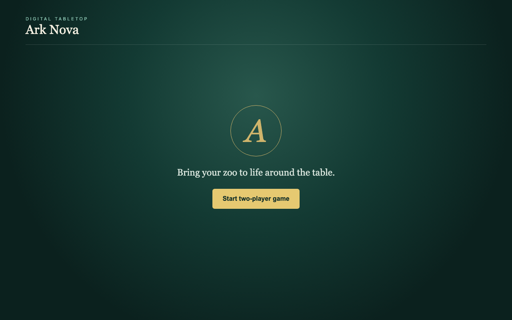
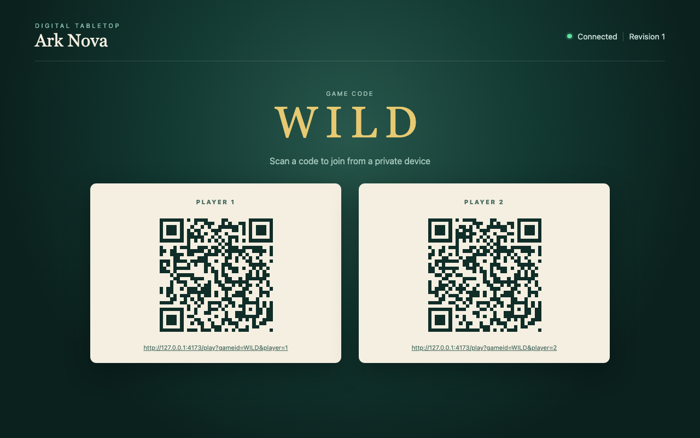
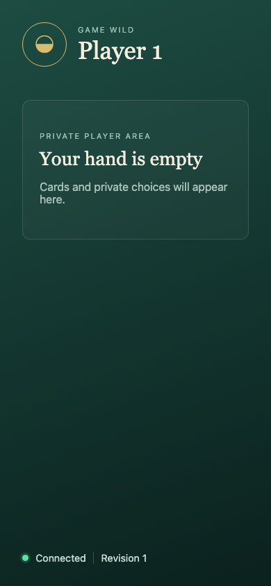
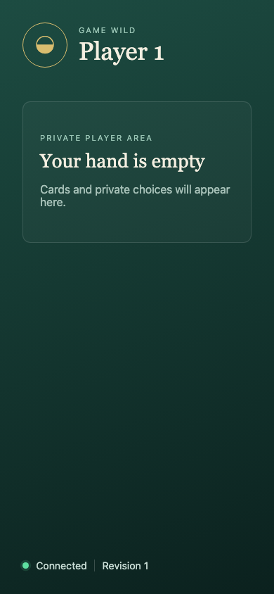

# Test: Create and Connect

A host creates a two-player game on the shared table, both players join on private devices, and every surface recovers from the canonical action log after the server restarts.

## The host opens the shared table and can start a two-player game.

### Shared table

**Verifications for Shared table:**
- [x] Ark Nova table heading is visible
- [x] Two-player game can be started

---

## Creating the game durably configures two seats and displays their stable QR URLs.

### Shared table

**Verifications for Shared table:**
- [x] Deterministic game code WILD is visible
- [x] Projection revision is 1
- [x] Player 1 QR code is visible
- [x] Player 2 QR code is visible
- [x] Exactly one GameConfigured action exists in the canonical log

---

## Both players join from isolated private devices while the table retains the public view.

### Shared table

**Verifications for Shared table:**
- [x] Game code remains WILD
- [x] Public projection remains at revision 1
- [x] Both companion QR codes remain visible

### Player 1 companion

**Verifications for Player 1 companion:**
- [x] Device is assigned to player 1
- [x] Private hand is empty
- [x] Private projection is at revision 1

### Player 2 companion

**Verifications for Player 2 companion:**
- [x] Device is assigned to player 2
- [x] Private hand is empty
- [x] Private projection is at revision 1

---

## After a real server restart, all devices recover the same game and revision without credentials or reconfiguration.

### Shared table

**Verifications for Shared table:**
- [x] Game code remains WILD
- [x] Public projection remains at revision 1
- [x] Both companion QR codes remain visible

### Player 1 companion

**Verifications for Player 1 companion:**
- [x] Device is assigned to player 1
- [x] Private hand is empty
- [x] Private projection is at revision 1

### Player 2 companion

**Verifications for Player 2 companion:**
- [x] Device is assigned to player 2
- [x] Private hand is empty
- [x] Private projection is at revision 1

---
