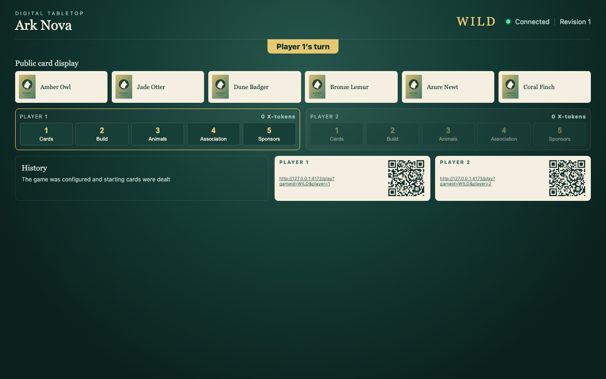
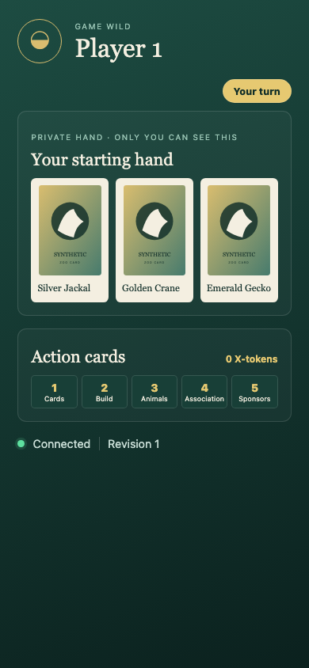
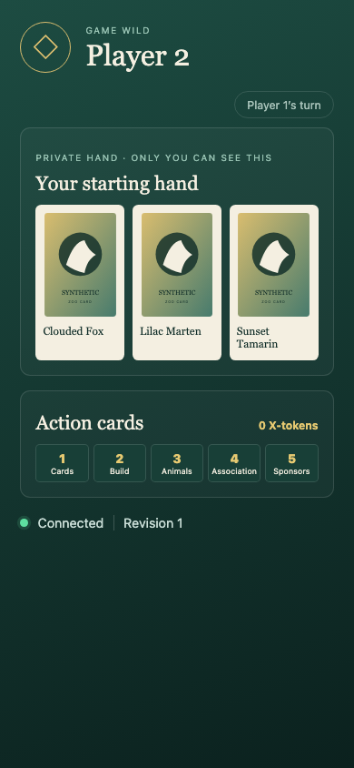
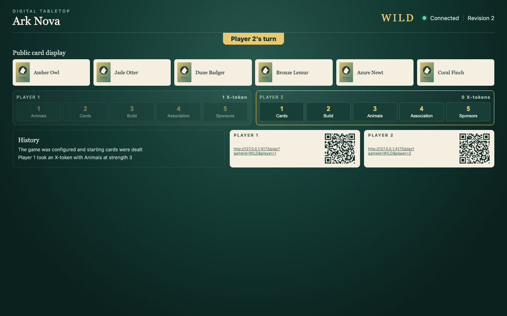
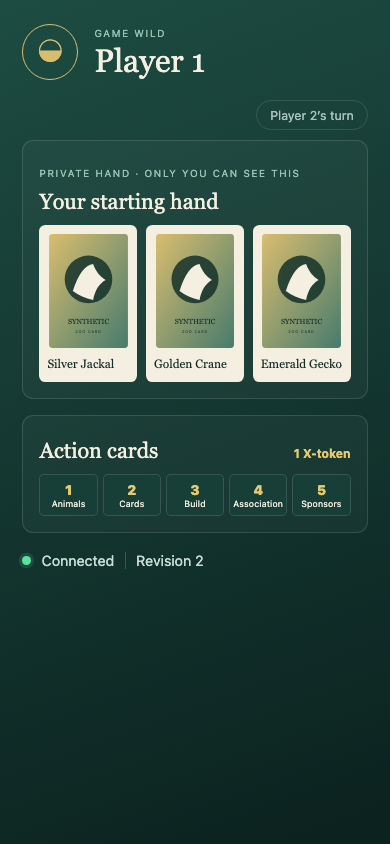
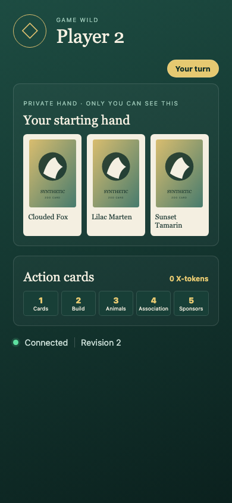

# Test: Private Setup and Turn

A deterministic synthetic deck creates a public display and private hands, then player 1 takes an X-token with the strength-3 action card and the next turn survives a projection rebuild.

## The public display and both private starting hands are dealt without leaking either hand to another surface.

### Shared table

**Verifications for Shared table:**
- [x] Six public display cards are visible
- [x] Player 1 is active
- [x] Animals is available at strength 3
- [x] Neither private hand appears on the table

### Player 1 companion

**Verifications for Player 1 companion:**
- [x] Exactly three private cards are visible
- [x] Player 1 cannot see the other player's hand
- [x] Player 1 is identified as active
- [x] Projection is at revision 1

### Player 2 companion

**Verifications for Player 2 companion:**
- [x] Exactly three private cards are visible
- [x] Player 2 cannot see the other player's hand
- [x] Player 1 is identified as active
- [x] Projection is at revision 1

---

## Player 1 takes an X-token with Animals at strength 3; Animals moves to slot 1 and player 2 becomes active everywhere.

### Shared table

**Verifications for Shared table:**
- [x] Player 2 is active
- [x] Player 1 has one X-token
- [x] Animals moved to strength 1
- [x] Public history explains the accepted action
- [x] Projection is at revision 2

### Player 1 companion

**Verifications for Player 1 companion:**
- [x] Private hand is unchanged
- [x] Player 2 is identified as active
- [x] Projection is at revision 2
- [x] Player 1 sees the gained X-token

### Player 2 companion

**Verifications for Player 2 companion:**
- [x] Private hand is unchanged
- [x] Player 2 is identified as active
- [x] Projection is at revision 2

---

## After deleting SQLite, replaying the two canonical actions restores the same deal, X-token, card order, and active player.

### Shared table

**Verifications for Shared table:**
- [x] Player 2 is active
- [x] Player 1 has one X-token
- [x] Animals moved to strength 1
- [x] Public history explains the accepted action
- [x] Projection is at revision 2

### Player 1 companion

**Verifications for Player 1 companion:**
- [x] Private hand is unchanged
- [x] Player 2 is identified as active
- [x] Projection is at revision 2
- [x] Player 1 sees the gained X-token

### Player 2 companion

**Verifications for Player 2 companion:**
- [x] Private hand is unchanged
- [x] Player 2 is identified as active
- [x] Projection is at revision 2

---
